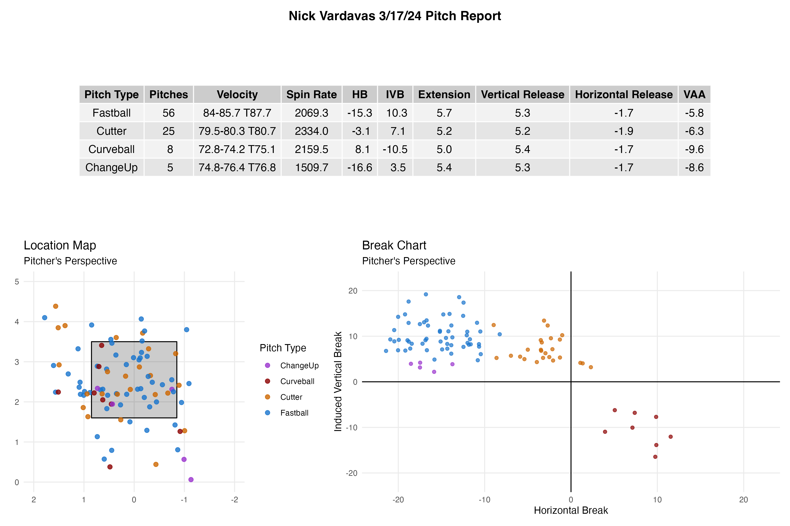
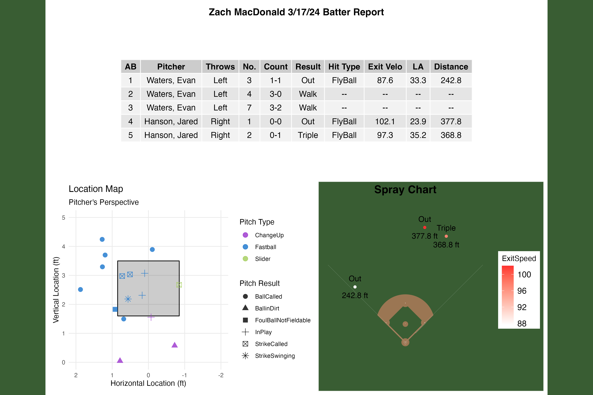
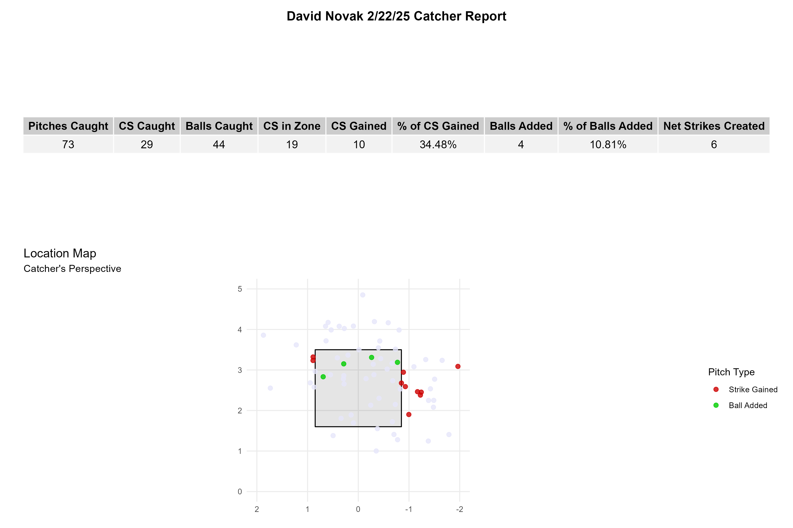

# Miami Baseball Analytics

End-to-end Trackman analytics pipeline built for Miami University Baseball: raw pitch-tracking data goes in, and player scouting reports, an interactive dashboard, and a pitcher-evaluation model come out.

Built and maintained as part of the analytics/R&D group supporting the coaching staff — cleaning game-by-game Trackman exports, generating per-player reports after every outing, and shipping a deployed web app that scores pitchers on process metrics independent of results.

All analytics/report code (R, Python, Shiny, the Dash app) was written without AI assistance. AI (Claude) was used afterward for repository reorganization and documentation.

## What it produces

<table>
<tr>
<td width="33%"></td>
<td width="33%"></td>
<td width="33%"></td>
</tr>
<tr>
<td align="center">Pitcher pitch profile — velo, spin, break by pitch type</td>
<td align="center">Hitter report — at-bat log, location, spray chart</td>
<td align="center">Catcher framing report — strikes gained/lost by pitch</td>
</tr>
</table>

Plus a live [Dash web app](controllables-app/) that ranks pitchers against 2024 reference percentiles using a trained xBABIP (CatBoost) model, and an interactive Shiny dashboard for filtering and exploring a season's pitch-level data.

## Pipeline

```
raw Trackman CSVs
      │
      ▼
scripts/trackman-extract/   →  pull, concatenate, filter raw exports
      │
      ▼
r/preprocessing.Rmd         →  clean, tag barrels/hard-hit, compute tilt
      │
      ├──▶ r/reports/       →  per-player scouting reports (see above)
      ├──▶ r/shiny/         →  interactive game-by-game dashboard
      └──▶ python/          →  percentile modeling → controllables-app/
```

## Structure

```
r/
  preprocessing.Rmd        # Cleans raw Trackman CSVs into cleanedPitcherGames.csv / cleanedBatterGames.csv
  season_cleaning.R        # Shared cleaning functions (barrels, tilt, PlayResult) used by both scripts below
  fallDataCleaning.R       # Fall-season file list + one-off player/pitch-type corrections
  games2025.R              # 2025 season file list + filtering
  reports/                 # Per-player report generators (pitcher, hitter, catcher, umpire, Scully)
  shiny/                   # Interactive Shiny dashboard (shinyPitchers.R, shinyBatters.R)

python/
  analysis/                # Player-specific analysis (Ahmad comparison notebook, helpers)
  preprocessing/           # Percentile preprocessing for the pitcher-controllables model

controllables-app/         # Deployed Dash app: pitcher controllables dashboard (xBABIP model)

scripts/
  trackman-extract/        # Scripts to pull/concatenate/filter raw Trackman exports
  riley/                   # Riley's scripts (Stuff+, xBA, bullpen, pre-season reports)
  experimental/            # One-off analyses (VAA, cutoffs, PCA) with their small input CSVs

sample-reports/            # Example rendered report images
```

## Setup

### R

Requires R with:

```r
install.packages(c("tidyverse", "readr", "lubridate", "DT", "patchwork",
                    "gridExtra", "grid", "kableExtra", "pander", "knitr",
                    "plyr", "shiny", "rsconnect"))

# sportyR (strike zone plotting) is not on CRAN
install.packages("remotes")
remotes::install_github("sportsdataverse/sportyR")
```

### Python

Requires Python 3 with `pandas`, `numpy`, `matplotlib`, `scipy`, and `catboost` (used by `python/preprocessing/preprocess_percentiles.py` and the Ahmad analysis notebook).

## Usage

**Cleaning raw data:** point `r/preprocessing.Rmd` at a directory of raw Trackman game CSVs (see `scripts/trackman-extract/` for pulling/filtering exports) and knit it. It writes `cleanedPitcherGames.csv` / `cleanedBatterGames.csv`.

**Generating a scouting report:** run the relevant script in `r/reports/` (e.g. `pitcherReports.R`) against a cleaned CSV; each writes report images like the ones above.

**Running the Shiny dashboard locally:** open `r/shiny/shinyPitchers.R` or `shinyBatters.R` in RStudio and click Run App. Each script currently expects its cleaned CSV at a hardcoded path (`~/Miami/Miami Baseball/ShinyApps/cleaned{Pitcher,Batter}Games.csv`) — update that `read.csv()` call to point at your local cleaned data before running.

## Data

Raw and cleaned Trackman CSVs are not tracked in this repo (see `.gitignore`) — regenerate them locally by running `r/preprocessing.Rmd` or the scripts in `scripts/trackman-extract/` against raw exports.
